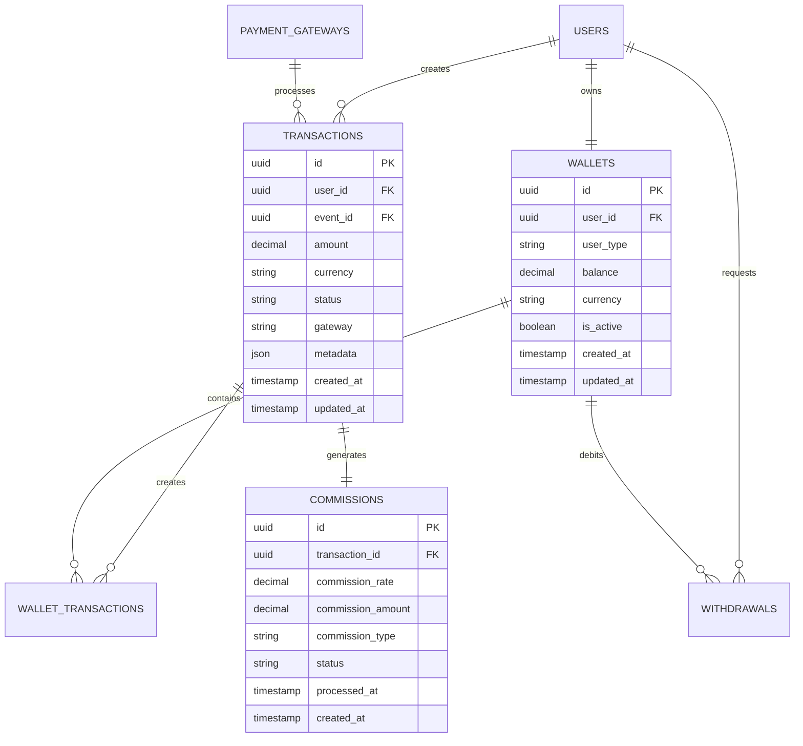
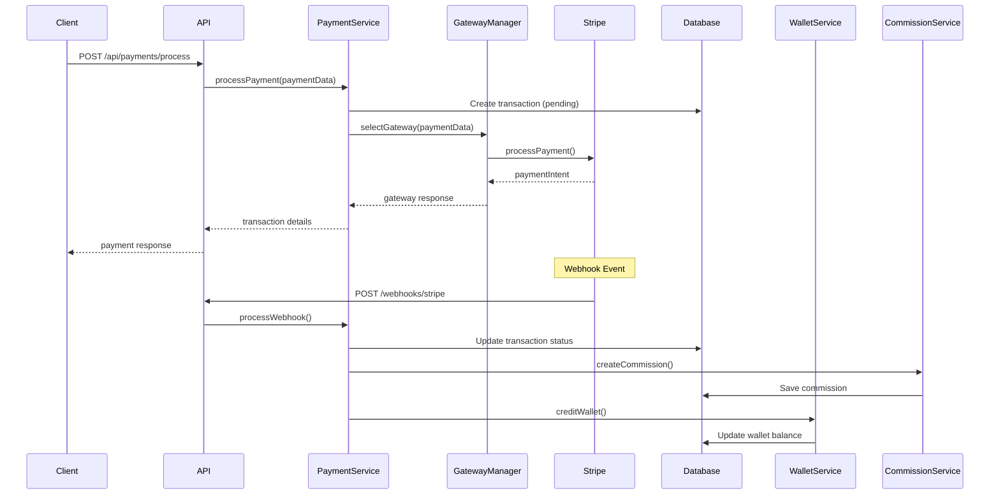
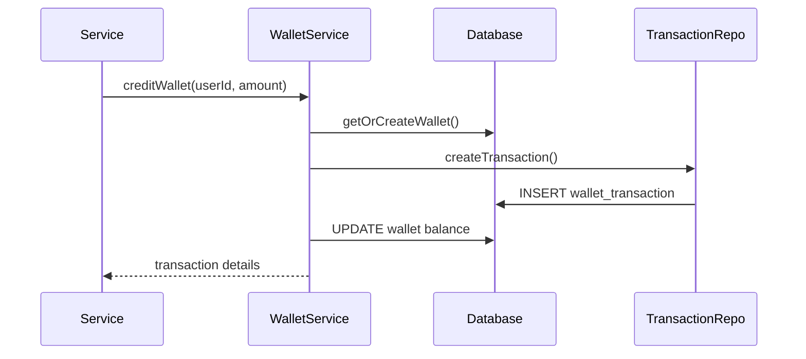

# Payment Service Architecture

## Overview

The Event Planner Payment Service is built on a microservices architecture with strict separation of concerns, designed for scalability, reliability, and maintainability. This document details the architectural decisions, patterns, and implementation details.

---

## 🏗️ **High-Level Architecture**

```
┌─────────────────────────────────────────────────────────────────┐
│                        API Gateway                               │
│                    (Authentication & Routing)                     │
└─────────────────────┬───────────────────────────────────────────┘
                      │
┌─────────────────────▼───────────────────────────────────────────┐
│                    Payment Service                              │
│  ┌─────────────┐ ┌─────────────┐ ┌─────────────┐ ┌─────────────┐│
│  │   Payment   │ │    Wallet   │ │ Commission  │ │   Payout    ││
│  │   Service   │ │   Service   │ │   Service   │ │   Service   ││
│  └─────────────┘ └─────────────┘ └─────────────┘ └─────────────┘│
└─────────────────────┬───────────────────────────────────────────┘
                      │
┌─────────────────────▼───────────────────────────────────────────┐
│                  Gateway Manager                                │
│  ┌─────────────┐ ┌─────────────┐ ┌─────────────┐ ┌─────────────┐│
│  │   Stripe    │ │   PayPal    │ │  CinetPay   │ │  MTN MoMo   ││
│  │  Gateway    │ │  Gateway    │ │  Gateway    │ │  Gateway    ││
│  └─────────────┘ └─────────────┘ └─────────────┘ └─────────────┘│
└─────────────────────┬───────────────────────────────────────────┘
                      │
┌─────────────────────▼───────────────────────────────────────────┐
│                    Data Layer                                   │
│  ┌─────────────┐ ┌─────────────┐ ┌─────────────┐ ┌─────────────┐│
│  │ PostgreSQL  │ │    Redis    │ │   Storage   │ │   Events    ││
│  │ (Primary)   │ │   (Cache)   │ │   (Files)   │ │ (Webhooks)  ││
│  └─────────────┘ └─────────────┘ └─────────────┘ └─────────────┘│
└─────────────────────────────────────────────────────────────────┘
```

---

## 🎯 **Core Principles**

### **1. Separation of Concerns**
- **Business Logic** isolated from technical implementation
- **Payment processing** separated from wallet management
- **Commission calculation** independent of transaction processing
- **Provider abstraction** for multi-gateway support

### **2. Single Responsibility**
- Each service has one clear purpose
- Controllers handle HTTP concerns only
- Services contain business logic only
- Repositories handle data access only

### **3. Dependency Inversion**
- High-level modules don't depend on low-level modules
- Both depend on abstractions (interfaces)
- Easy to swap implementations

### **4. Event-Driven Communication**
- Asynchronous processing for non-critical operations
- Webhooks for external system notifications
- Event sourcing for audit trails

---

## 📊 **Domain Model**

### **Core Entities**



### **Value Objects**

```javascript
// Money Value Object
class Money {
  constructor(amount, currency) {
    this.amount = amount;
    this.currency = currency;
    this.validate();
  }
  
  validate() {
    if (this.amount < 0) throw new Error('Amount cannot be negative');
    if (!this.isValidCurrency(this.currency)) throw new Error('Invalid currency');
  }
  
  add(other) {
    if (this.currency !== other.currency) {
      throw new Error('Cannot add different currencies');
    }
    return new Money(this.amount + other.amount, this.currency);
  }
}

// Transaction Status Enum
const TransactionStatus = {
  PENDING: 'pending',
  PROCESSING: 'processing',
  COMPLETED: 'completed',
  FAILED: 'failed',
  CANCELLED: 'cancelled'
};
```

---

## 🔧 **Service Architecture**

### **Payment Service**

```javascript
class PaymentService {
  constructor(gatewayManager, walletService, commissionService) {
    this.gatewayManager = gatewayManager;
    this.walletService = walletService;
    this.commissionService = commissionService;
  }
  
  async processPayment(paymentData) {
    // 1. Validate payment data
    // 2. Select appropriate gateway
    // 3. Create transaction record
    // 4. Process payment with gateway
    // 5. Handle webhook response
    // 6. Update transaction status
    // 7. Process commissions
    // 8. Update wallets
  }
}
```

**Responsibilities:**
- Payment transaction orchestration
- Gateway selection and routing
- Transaction lifecycle management
- Webhook processing
- Error handling and retries

### **Wallet Service**

```javascript
class WalletService {
  constructor(walletRepository, transactionRepository) {
    this.walletRepo = walletRepository;
    this.transactionRepo = transactionRepository;
  }
  
  async creditWallet(userId, userType, amount, referenceType, referenceId) {
    // 1. Get or create wallet
    // 2. Validate amount
    // 3. Create wallet transaction (immutable)
    // 4. Update wallet balance
    // 5. Return transaction details
  }
}
```

**Responsibilities:**
- Wallet creation and management
- Balance operations (credit/debit)
- Transaction history tracking
- Wallet-to-wallet transfers
- Balance validation

### **Commission Service**

```javascript
class CommissionService {
  constructor(commissionRepository) {
    this.commissionRepo = commissionRepository;
  }
  
  calculateCommission(amount, commissionType, options = {}) {
    // 1. Get commission rate for type
    // 2. Apply user-specific rates if applicable
    // 3. Calculate commission amount
    // 4. Return calculation details
  }
}
```

**Responsibilities:**
- Commission rate management
- Commission calculation
- Commission processing
- Statistics and reporting
- Rate configuration

### **Payout Service**

```javascript
class PayoutService {
  constructor(walletService, gatewayManager) {
    this.walletService = walletService;
    this.gatewayManager = gatewayManager;
  }
  
  async createPayoutRequest(userId, userType, amount, payoutDetails) {
    // 1. Validate amount and limits
    // 2. Check wallet balance
    // 3. Calculate processing fees
    // 4. Debit wallet
    // 5. Create withdrawal record
    // 6. Process payout asynchronously
  }
}
```

**Responsibilities:**
- Withdrawal request processing
- User limit validation
- Processing fee calculation
- Payout execution
- Status tracking

---

## 🌉 **Gateway Abstraction**

### **Base Gateway Interface**

```javascript
class BaseGateway {
  constructor(config) {
    this.config = config;
    this.name = config.name;
    this.code = config.code;
  }
  
  // Abstract methods - must be implemented by concrete gateways
  async processPayment(paymentData) {
    throw new Error('processPayment must be implemented');
  }
  
  async verifyWebhook(payload, signature) {
    throw new Error('verifyWebhook must be implemented');
  }
  
  async createPayout(payoutData) {
    throw new Error('createPayout must be implemented');
  }
  
  // Common utility methods
  validateAmount(amount) {
    return amount > 0 && amount <= this.config.maxAmount;
  }
  
  formatCurrency(amount, currency) {
    return new Intl.NumberFormat('en-US', {
      style: 'currency',
      currency: currency
    }).format(amount);
  }
}
```

### **Concrete Gateway Implementations**

```javascript
class StripeGateway extends BaseGateway {
  constructor(config) {
    super(config);
    this.stripe = require('stripe')(config.apiKey);
  }
  
  async processPayment(paymentData) {
    try {
      const paymentIntent = await this.stripe.paymentIntents.create({
        amount: Math.round(paymentData.amount * 100), // Convert to cents
        currency: paymentData.currency.toLowerCase(),
        metadata: paymentData.metadata,
        description: paymentData.description,
        automatic_payment_methods: { enabled: true }
      });
      
      return {
        success: true,
        gatewayTransactionId: paymentIntent.id,
        clientSecret: paymentIntent.client_secret,
        status: this.mapStatus(paymentIntent.status)
      };
    } catch (error) {
      return {
        success: false,
        error: error.message,
        code: error.code
      };
    }
  }
  
  async verifyWebhook(payload, signature) {
    try {
      const event = this.stripe.webhooks.constructEvent(
        payload,
        signature,
        this.config.webhookSecret
      );
      return { success: true, event };
    } catch (error) {
      return { success: false, error: error.message };
    }
  }
}
```

---

## 🔄 **Data Flow Patterns**

### **Payment Processing Flow**



### **Wallet Transaction Flow**



---

## 🗄️ **Database Architecture**

### **Schema Design Principles**

1. **Normalization**: Follow 3NF for data integrity
2. **Immutability**: Transaction records never updated
3. **Audit Trail**: All changes tracked with timestamps
4. **Performance**: Strategic indexing for query optimization

### **Key Tables**

```sql
-- Transactions (immutable financial records)
CREATE TABLE transactions (
    id UUID PRIMARY KEY DEFAULT gen_random_uuid(),
    user_id UUID NOT NULL REFERENCES users(id),
    event_id UUID REFERENCES events(id),
    amount DECIMAL(15,2) NOT NULL CHECK (amount > 0),
    currency VARCHAR(3) NOT NULL,
    status VARCHAR(20) NOT NULL DEFAULT 'pending',
    gateway VARCHAR(50) NOT NULL,
    gateway_transaction_id VARCHAR(255),
    metadata JSONB DEFAULT '{}',
    created_at TIMESTAMP WITH TIME ZONE DEFAULT NOW(),
    updated_at TIMESTAMP WITH TIME ZONE DEFAULT NOW()
);

-- Wallets (current state)
CREATE TABLE wallets (
    id UUID PRIMARY KEY DEFAULT gen_random_uuid(),
    user_id UUID NOT NULL REFERENCES users(id),
    user_type VARCHAR(20) NOT NULL,
    balance DECIMAL(15,2) NOT NULL DEFAULT 0.00 CHECK (balance >= 0),
    currency VARCHAR(3) NOT NULL DEFAULT 'EUR',
    is_active BOOLEAN DEFAULT true,
    created_at TIMESTAMP WITH TIME ZONE DEFAULT NOW(),
    updated_at TIMESTAMP WITH TIME ZONE DEFAULT NOW(),
    UNIQUE(user_id, user_type)
);

-- Wallet Transactions (immutable history)
CREATE TABLE wallet_transactions (
    id UUID PRIMARY KEY DEFAULT gen_random_uuid(),
    wallet_id UUID NOT NULL REFERENCES wallets(id),
    amount DECIMAL(15,2) NOT NULL,
    transaction_type VARCHAR(10) NOT NULL CHECK (transaction_type IN ('credit', 'debit')),
    reference_type VARCHAR(50),
    reference_id UUID,
    balance_before DECIMAL(15,2) NOT NULL,
    balance_after DECIMAL(15,2) NOT NULL,
    description TEXT,
    metadata JSONB DEFAULT '{}',
    created_at TIMESTAMP WITH TIME ZONE DEFAULT NOW()
);
```

### **Indexing Strategy**

```sql
-- Performance indexes
CREATE INDEX idx_transactions_user_id ON transactions(user_id);
CREATE INDEX idx_transactions_status ON transactions(status);
CREATE INDEX idx_transactions_created_at ON transactions(created_at DESC);
CREATE INDEX idx_transactions_gateway ON transactions(gateway);

CREATE INDEX idx_wallets_user_id ON wallets(user_id, user_type);
CREATE INDEX idx_wallet_transactions_wallet_id ON wallet_transactions(wallet_id);
CREATE INDEX idx_wallet_transactions_created_at ON wallet_transactions(created_at DESC);

-- Composite indexes for common queries
CREATE INDEX idx_transactions_user_status ON transactions(user_id, status);
CREATE INDEX idx_wallet_transactions_wallet_type ON wallet_transactions(wallet_id, transaction_type);
```

---

## 🔒 **Security Architecture**

### **Authentication & Authorization**

```javascript
// JWT Middleware
const authenticate = async (req, res, next) => {
  try {
    const token = req.headers.authorization?.replace('Bearer ', '');
    const decoded = jwt.verify(token, process.env.JWT_SECRET);
    req.user = decoded;
    next();
  } catch (error) {
    res.status(401).json({ success: false, error: 'Invalid token' });
  }
};

// RBAC Middleware
const requirePermission = (permission) => {
  return async (req, res, next) => {
    const hasPermission = await authClient.checkPermission(req.user.id, permission);
    if (!hasPermission) {
      return res.status(403).json({ success: false, error: 'Insufficient permissions' });
    }
    next();
  };
};
```

### **Data Protection**

```javascript
// Sensitive data encryption
const encryptSensitiveData = (data) => {
  const algorithm = 'aes-256-gcm';
  const key = crypto.scryptSync(process.env.ENCRYPTION_KEY, 'salt', 32);
  const iv = crypto.randomBytes(16);
  const cipher = crypto.createCipher(algorithm, key, iv);
  
  let encrypted = cipher.update(JSON.stringify(data), 'utf8', 'hex');
  encrypted += cipher.final('hex');
  
  return { encrypted, iv: iv.toString('hex') };
};

// Input validation with Joi
const paymentSchema = Joi.object({
  amount: Joi.number().positive().max(100000).required(),
  currency: Joi.string().valid('EUR', 'USD', 'XOF', 'XAF').required(),
  paymentMethod: Joi.string().valid('stripe', 'paypal', 'cinetpay').required(),
  customerEmail: Joi.string().email().required()
});
```

### **Webhook Security**

```javascript
// Signature verification for each provider
const verifyStripeWebhook = (payload, signature) => {
  try {
    return stripe.webhooks.constructEvent(
      payload,
      signature,
      process.env.STRIPE_WEBHOOK_SECRET
    );
  } catch (error) {
    throw new Error(`Webhook signature verification failed: ${error.message}`);
  }
};

// Replay attack prevention
const processWebhook = async (payload, signature, provider) => {
  const eventId = extractEventId(payload, provider);
  
  // Check if event already processed
  const existingEvent = await getProcessedEvent(eventId);
  if (existingEvent) {
    throw new Error('Event already processed');
  }
  
  // Mark event as processed
  await markEventProcessed(eventId);
  
  // Process the event
  return await handleWebhookEvent(payload, provider);
};
```

---

## 📈 **Scalability Architecture**

### **Horizontal Scaling**

```yaml
# Kubernetes deployment with auto-scaling
apiVersion: autoscaling/v2
kind: HorizontalPodAutoscaler
metadata:
  name: payment-service-hpa
spec:
  scaleTargetRef:
    apiVersion: apps/v1
    kind: Deployment
    name: payment-service
  minReplicas: 2
  maxReplicas: 10
  metrics:
  - type: Resource
    resource:
      name: cpu
      target:
        type: Utilization
        averageUtilization: 70
  - type: Resource
    resource:
      name: memory
      target:
        type: Utilization
        averageUtilization: 80
```

### **Database Scaling**

```sql
-- Read replicas for read-heavy operations
CREATE DATABASE event_planner_payments_readonly;

-- Connection pooling
ALTER SYSTEM SET max_connections = 200;
ALTER SYSTEM SET shared_buffers = '256MB';
ALTER SYSTEM SET effective_cache_size = '1GB';

-- Partitioning for large tables
CREATE TABLE transactions_2024 PARTITION OF transactions
FOR VALUES FROM ('2024-01-01') TO ('2025-01-01');

CREATE TABLE transactions_2025 PARTITION OF transactions
FOR VALUES FROM ('2025-01-01') TO ('2026-01-01');
```

### **Caching Strategy**

```javascript
// Multi-level caching
class CacheManager {
  constructor() {
    this.memoryCache = new Map(); // L1: In-memory
    this.redisCache = redisClient; // L2: Redis
  }
  
  async get(key) {
    // Try memory cache first
    if (this.memoryCache.has(key)) {
      return this.memoryCache.get(key);
    }
    
    // Try Redis cache
    const cached = await this.redisCache.get(key);
    if (cached) {
      this.memoryCache.set(key, JSON.parse(cached));
      return JSON.parse(cached);
    }
    
    return null;
  }
  
  async set(key, value, ttl = 300) {
    // Set in both caches
    this.memoryCache.set(key, value);
    await this.redisCache.setex(key, ttl, JSON.stringify(value));
  }
}
```

---

## 🔧 **Configuration Architecture**

### **Environment-Based Configuration**

```javascript
// config/index.js
const config = {
  development: {
    database: {
      host: 'localhost',
      port: 5432,
      name: 'event_planner_payments_dev'
    },
    gateways: {
      stripe: {
        apiKey: process.env.STRIPE_TEST_KEY,
        webhookSecret: process.env.STRIPE_TEST_WEBHOOK_SECRET
      }
    }
  },
  
  production: {
    database: {
      host: process.env.DB_HOST,
      port: process.env.DB_PORT,
      name: process.env.DB_NAME,
      ssl: true
    },
    gateways: {
      stripe: {
        apiKey: process.env.STRIPE_SECRET_KEY,
        webhookSecret: process.env.STRIPE_WEBHOOK_SECRET
      }
    }
  }
};

module.exports = config[process.env.NODE_ENV || 'development'];
```

### **Feature Flags**

```javascript
// config/features.js
const features = {
  new_payment_flow: process.env.ENABLE_NEW_PAYMENT_FLOW === 'true',
  experimental_gateways: process.env.ENABLE_EXPERIMENTAL_GATEWAYS === 'true',
  enhanced_logging: process.env.ENABLE_ENHANCED_LOGGING === 'true'
};

const isFeatureEnabled = (feature) => {
  return features[feature] || false;
};

module.exports = { isFeatureEnabled };
```

---

## 📊 **Monitoring & Observability**

### **Metrics Collection**

```javascript
// Custom metrics
const metrics = {
  paymentTransactions: new promClient.Counter({
    name: 'payment_transactions_total',
    help: 'Total payment transactions',
    labelNames: ['gateway', 'status', 'currency']
  }),
  
  paymentAmount: new promClient.Histogram({
    name: 'payment_amount_histogram',
    help: 'Payment amount distribution',
    labelNames: ['gateway', 'currency'],
    buckets: [1, 5, 10, 25, 50, 100, 250, 500, 1000, 2500, 5000, 10000]
  }),
  
  walletBalance: new promClient.Gauge({
    name: 'wallet_balance',
    help: 'Current wallet balance',
    labelNames: ['user_type', 'currency']
  })
};
```

### **Distributed Tracing**

```javascript
// OpenTelemetry integration
const { trace } = require('@opentelemetry/api');

const tracer = trace.getTracer('payment-service');

const processPaymentWithTracing = async (paymentData) => {
  const span = tracer.startSpan('process-payment');
  
  try {
    span.setAttributes({
      'payment.amount': paymentData.amount,
      'payment.currency': paymentData.currency,
      'payment.gateway': paymentData.paymentMethod
    });
    
    const result = await processPayment(paymentData);
    
    span.setAttributes({
      'payment.status': result.status,
      'payment.transaction_id': result.transactionId
    });
    
    return result;
  } catch (error) {
    span.recordException(error);
    throw error;
  } finally {
    span.end();
  }
};
```

---

## 🔄 **Event-Driven Architecture**

### **Domain Events**

```javascript
// Event definitions
class PaymentCompletedEvent {
  constructor(transactionId, userId, amount, gateway) {
    this.type = 'PAYMENT_COMPLETED';
    this.data = { transactionId, userId, amount, gateway };
    this.timestamp = new Date().toISOString();
  }
}

class WalletCreditedEvent {
  constructor(walletId, userId, amount, referenceType) {
    this.type = 'WALLET_CREDITED';
    this.data = { walletId, userId, amount, referenceType };
    this.timestamp = new Date().toISOString();
  }
}

// Event publisher
class EventPublisher {
  constructor(eventBus) {
    this.eventBus = eventBus;
  }
  
  async publish(event) {
    await this.eventBus.publish(event.type, event);
  }
}
```

### **Event Handlers**

```javascript
// Event handlers for side effects
class PaymentEventHandler {
  constructor(notificationService, analyticsService) {
    this.notificationService = notificationService;
    this.analyticsService = analyticsService;
  }
  
  async handlePaymentCompleted(event) {
    // Send confirmation email
    await this.notificationService.sendPaymentConfirmation(event.data);
    
    // Update analytics
    await this.analyticsService.trackPayment(event.data);
    
    // Update user metrics
    await this.updateUserMetrics(event.data.userId);
  }
}
```

---

This architecture provides a solid foundation for a scalable, maintainable, and secure payment service that can handle the complex requirements of the Event Planner platform.
