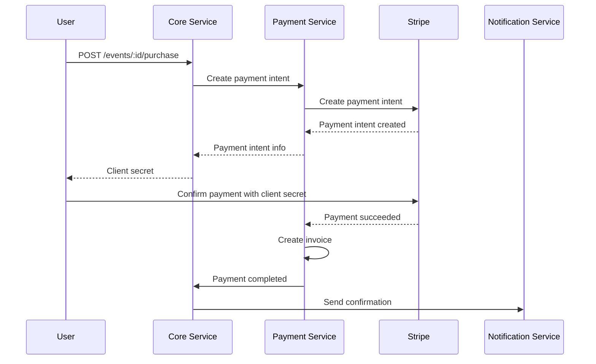

# 💳 PAYMENT SERVICE - DOCUMENTATION TECHNIQUE

## 🎯 Vue d'ensemble

Le **Payment Service** est le service spécialisé dans la gestion des transactions financières de la plateforme Event Planner SaaS. Il gère les paiements, factures, remboursements et webhooks avec une sécurité de niveau PCI DSS.

## 🏗️ Architecture Technique

### Stack Technique
```
┌─────────────────────────────────────────┐
│           PAYMENT SERVICE                  │
├─────────────────────────────────────────┤
│ 📦 Node.js + Express.js                  │
│ 🗄️ PostgreSQL (transactions)              │
│ 🔴 Redis (cache + sessions)                │
│ 💳 Stripe (payment processor)             │
│ 🅿️ PayPal (alternative provider)            │
│ 📄 PDFKit (invoices)                        │
│ 🎨 Handlebars (templates)                    │
│ 📊 Winston (logs)                        │
│ 📊 Prometheus (métriques)                │
└─────────────────────────────────────────┘
```

### Architecture en Couches
```
┌─────────────────────────────────────────┐
│              API LAYER                   │
│  ┌─────────────┬─────────────────────────┐   │
│  │   Routes    │     Controllers        │   │
│  │  (Express)   │    (Business Logic)     │   │
│  └─────────────┴─────────────────────────┘   │
├─────────────────────────────────────────┤
│             SERVICE LAYER                 │
│  ┌─────────────┬─────────────────────────┐   │
│  │   Services   │     Repositories       │   │
│  │ (Core Logic) │   (Data Access)        │   │
│  └─────────────┴─────────────────────────┘   │
├─────────────────────────────────────────┤
│            PROVIDERS LAYER               │
│  ┌─────────────┬─────────────────────────┐   │
│  │   Stripe    │      PayPal           │   │
│  │  Provider   │      Provider        │   │
│  └─────────────┴─────────────────────────┘   │
├─────────────────────────────────────────┤
│              DATA LAYER                   │
│  ┌─────────────┬─────────────────────────┐   │
│  │ PostgreSQL  │        Redis            │
│  │ (Transactions)│      (Cache/Session)   │   │
│  └─────────────┴─────────────────────────┘   │
└─────────────────────────────────────────┘
```

## 💳 Architecture de Paiement

### 1. Flux de Paiement


### 2. Modèle de Données de Paiement
```javascript
const PaymentSchema = {
  id: 'BIGSERIAL PRIMARY KEY',
  userId: 'BIGINT NOT NULL',
  eventId: 'BIGINT NOT NULL',
  amount: 'DECIMAL(10,2) NOT NULL',
  currency: 'VARCHAR(3) DEFAULT EUR',
  status: 'VARCHAR(20) DEFAULT pending', // pending, succeeded, failed, cancelled, refunded
  paymentIntentId: 'VARCHAR(255)', // Stripe payment intent ID
  paymentMethodId: 'VARCHAR(255)', // Stripe payment method ID
  provider: 'VARCHAR(20) DEFAULT stripe', // stripe, paypal
  metadata: 'JSONB',
  createdAt: 'TIMESTAMP WITH TIME ZONE DEFAULT NOW',
  updatedAt: 'TIMESTAMP WITH TIME ZONE DEFAULT NOW'
};
```

### 3. Gestion des Webhooks
```javascript
class WebhookService {
  constructor() {
    this.stripe = new StripeWebhookService();
    this.paypal = new PayPalWebhookService();
  }
  
  async handleWebhook(provider, signature, payload) {
    try {
      switch (provider) {
        case 'stripe':
          return await this.stripe.handleWebhook(signature, payload);
        case 'paypal':
          return await this.paypal.handleWebhook(signature, payload);
        default:
          throw new Error(`Unsupported provider: ${provider}`);
      }
    } catch (error) {
      logger.error('Webhook handling failed', {
        provider,
        error: error.message,
        payload
      });
      throw error;
    }
  }
}

class StripeWebhookService {
  async handleWebhook(signature, payload) {
    // Vérifier la signature Stripe
    const event = stripe.webhooks.constructEvent(payload, signature);
    
    switch (event.type) {
      case 'payment_intent.succeeded':
        await this.handlePaymentSucceeded(event);
        break;
      case 'payment_intent.payment_failed':
        await this.handlePaymentFailed(event);
        break;
      case 'payment_intent.canceled':
        await this.handlePaymentCanceled(event);
        break;
      default:
        logger.info('Unhandled webhook event', { type: event.type });
    }
    
    return { success: true, event: event.type };
  }
  
  async handlePaymentSucceeded(event) {
    const paymentIntent = event.data.object;
    
    // Mettre à jour le statut en base de données
    await this.paymentRepository.updateStatus(
      paymentIntent.metadata.paymentId,
      'succeeded',
      {
        provider: 'stripe',
        providerTransactionId: paymentIntent.id,
        providerData: paymentIntent
      }
    );
    
    // Notifier le Core Service
    await this.notifyCoreService({
      type: 'payment.succeeded',
      paymentId: paymentIntent.metadata.paymentId,
      amount: paymentIntent.amount,
      currency: paymentIntent.currency,
      metadata: paymentIntent.metadata
    });
    
    logger.info('Payment succeeded', {
      paymentId: paymentIntent.metadata.paymentId,
      amount: paymentIntent.amount,
      currency: paymentIntent.currency
    });
  }
}
```

## 🏦️ Gestion des Factures

### 1. Génération de Factures PDF
```javascript
class InvoiceService {
  constructor() {
    this.pdfGenerator = new PDFGenerator();
    this.templateService = new TemplateService();
  }
  
  async generateInvoice(paymentId) {
    // Récupérer les informations du paiement
    const payment = await this.paymentRepository.findById(paymentId);
    const user = await this.getUserById(payment.userId);
    const event = await this.getEventById(payment.eventId);
    
    // Préparer les données du template
    const templateData = {
      invoiceNumber: this.generateInvoiceNumber(),
      date: new Date().toLocaleDateString('fr-FR'),
      dueDate: new Date(Date.now() + 30 * 24 * 60 * 60 * 1000).toLocaleDateString('fr-FR'),
      customer: {
        name: `${user.firstName} ${user.lastName}`,
        email: user.email,
        address: user.billingAddress || {}
      },
      items: await this.getInvoiceItems(paymentId),
      totals: this.calculateTotals(payment),
      event: {
        name: event.title,
        date: event.eventDate,
        location: event.location
      },
      payment: {
        method: payment.provider,
        transactionId: payment.providerTransactionId,
        date: payment.createdAt
      }
    };
    
    // Générer le PDF
    const pdfBuffer = await this.pdfGenerator.generateInvoice(templateData);
    
    // Sauvegarder le PDF
    const invoicePath = await this.saveInvoicePDF(pdfBuffer, templateData.invoiceNumber);
    
    // Mettre à jour le paiement
    await this.paymentRepository.update(paymentId, {
      invoicePath,
      invoiceNumber: templateData.invoiceNumber
    });
    
    return {
      invoicePath,
      invoiceNumber: templateData.invoiceNumber,
      pdfBuffer
    };
  }
  
  generateInvoiceNumber() {
    const date = new Date().toISOString().slice(0, 10).replace(/-/g, '');
    const random = Math.random().toString(36).substr(2, 6).toUpperCase();
    return `INV-${date}-${random}`;
  }
}
```

### 2. Template de Facture
```handlebars
<!DOCTYPE html>
<html>
<head>
    <meta charset="utf-8">
    <title>Facture {{invoiceNumber}}</title>
    <style>
        body { font-family: Arial, sans-serif; margin: 0; padding: 20px; }
        .header { border-bottom: 2px solid #007bff; padding: 20px 0; margin-bottom: 20px; }
        .invoice-details { margin-bottom: 20px; }
        .customer-details { margin-bottom: 20px; }
        .items { margin-bottom: 20px; }
        .item { display: flex; justify-content: space-between; margin-bottom: 10px; }
        .totals { text-align: right; margin-top: 20px; }
        .footer { border-top: 2px solid #007bff; padding: 20px 0; margin-top: 20px; text-align: center; }
    </style>
</head>
<body>
    <div class="header">
        <h1>Facture {{invoiceNumber}}</h1>
        <p>Date: {{date}} | Échéance: {{dueDate}}</p>
    </div>
    
    <div class="customer-details">
        <h2>Client</h2>
        <p>{{customer.name}}</p>
        <p>{{customer.email}}</p>
        <p>{{customer.address.street}}</p>
        <p>{{customer.address.city}}, {{customer.address.country}}</p>
    </div>
    
    <div class="invoice-details">
        <h2>Événement</h2>
        <p>{{event.name}}</p>
        <p>{{event.date}} | {{event.location}}</p>
    </div>
    
    <div class="items">
        <h3>Détails de la facture</h3>
        {{#each items}}
        <div class="item">
            <span>{{description}}</span>
            <span>{{quantity}} x {{price}}€</span>
            <span>{{total}}€</span>
        </div>
        {{/each}}
    </div>
    
    <div class="totals">
        <p><strong>Sous-total:</strong> {{subtotal}}€</p>
        <p><strong>TVA (20%):</strong> {{tax}}€</p>
        <p><strong>Total:</strong> {{total}}€</p>
    </div>
    
    <div class="footer">
        <p>Méthode de paiement: {{payment.method}}</p>
        <p>Transaction ID: {{payment.transactionId}}</p>
        <p>Merci pour votre confiance !</p>
    </div>
</body>
</html>
```

## 🔄 Remboursements

### 1. Processus de Rembourse
```javascript
class RefundService {
  async processRefund(paymentId, amount, reason) {
    // Valider le rembourse
    const payment = await this.validateRefund(paymentId, amount);
    
    try {
      // Rembourser via le provider
      const refundResult = await this.processRefundWithProvider(payment, amount);
      
      // Mettre à jour en base de données
      const refund = await this.refundRepository.create({
        paymentId,
        amount,
        reason,
        status: 'succeeded',
        providerRefundId: refundResult.id,
        providerData: refundResult
      });
      
      // Mettre à jour le statut du paiement
      await this.paymentRepository.updateStatus(paymentId, 'refunded');
      
      // Notifier les services concernés
      await this.notifyRefundProcessed(refund);
      
      return refund;
      
    } catch (error) {
      logger.error('Refund failed', {
        paymentId,
        amount,
        reason,
        error: error.message
      });
      
      throw new RefundError('Refund processing failed', error);
    }
  }
  
  async validateRefund(paymentId, amount) {
    const payment = await this.paymentRepository.findById(paymentId);
    
    if (!payment) {
      throw new ValidationError('Payment not found');
    }
    
    if (payment.status !== 'succeeded') {
      throw new ValidationError('Payment cannot be refunded');
    }
    
    if (amount > payment.amount) {
      throw new ValidationError('Refund amount exceeds payment amount');
    }
    
    // Vérifier la politique de rembourse
    const daysSincePayment = this.getDaysSincePayment(payment.createdAt);
    if (daysSincePayment > 30) {
      throw new ValidationError('Refund period expired');
    }
    
    return payment;
  }
  
  async processRefundWithProvider(payment, amount) {
    switch (payment.provider) {
      case 'stripe':
        return await this.refundWithStripe(payment, amount);
      case 'paypal':
        return await this.refundWithPayPal(payment, amount);
      default:
        throw new Error(`Unsupported provider for refund: ${payment.provider}`);
    }
  }
  
  async refundWithStripe(payment, amount) {
    const refund = await stripe.refunds.create({
      payment_intent: payment.providerTransactionId,
      amount: Math.round(amount * 100), // Stripe utilise les centimes
      reason: 'Customer requested refund'
    });
    
    return {
      id: refund.id,
      status: refund.status,
      amount: refund.amount / 100
    };
  }
}
```

## 🗄️ Base de Données

### 1. Schéma Principal
```sql
-- Paiements
CREATE TABLE payments (
    id BIGSERIAL PRIMARY KEY,
    user_id BIGINT NOT NULL,
    event_id BIGINT NOT NULL,
    amount DECIMAL(10,2) NOT NULL,
    currency VARCHAR(3) DEFAULT 'EUR',
    status VARCHAR(20) DEFAULT 'pending',
    payment_intent_id VARCHAR(255),
    payment_method_id VARCHAR(255),
    provider VARCHAR(20) DEFAULT 'stripe',
    provider_transaction_id VARCHAR(255),
    metadata JSONB,
    invoice_path VARCHAR(500),
    invoice_number VARCHAR(50),
    created_at TIMESTAMP WITH TIME ZONE DEFAULT NOW(),
    updated_at TIMESTAMP WITH TIME ZONE DEFAULT NOW(),
    CONSTRAINT fk_payments_user FOREIGN KEY (user_id) REFERENCES users(id),
    CONSTRAINT fk_payments_event FOREIGN KEY (event_id) REFERENCES events(id)
);

-- Remboursements
CREATE TABLE refunds (
    id BIGSERIAL PRIMARY KEY,
    payment_id BIGINT NOT NULL,
    amount DECIMAL(10,2) NOT NULL,
    reason TEXT,
    status VARCHAR(20) DEFAULT 'pending',
    provider_refund_id VARCHAR(255),
    provider_data JSONB,
    processed_at TIMESTAMP WITH TIME ZONE,
    created_at TIMESTAMP WITH TIME ZONE DEFAULT NOW(),
    updated_at TIMESTAMP WITH TIME ZONE DEFAULT NOW(),
    CONSTRAINT fk_refunds_payment FOREIGN KEY (payment_id) REFERENCES payments(id)
);

-- Factures
CREATE TABLE invoices (
    id BIGSERIAL PRIMARY KEY,
    payment_id BIGINT NOT NULL,
    invoice_number VARCHAR(50) UNIQUE NOT NULL,
    invoice_path VARCHAR(500) NOT NULL,
    pdf_data BYTEA,
    status VARCHAR(20) DEFAULT 'generated',
    created_at TIMESTAMP WITH TIME ZONE DEFAULT NOW(),
    updated_at TIMESTAMP WITH TIME ZONE DEFAULT NOW(),
    CONSTRAINT fk_invoices_payment FOREIGN KEY (payment_id) REFERENCES payments(id)
);

-- Webhooks
CREATE TABLE webhooks (
    id BIGSERIAL PRIMARY KEY,
    provider VARCHAR(20) NOT NULL,
    event_type VARCHAR(100) NOT NULL,
    payload JSONB NOT NULL,
    signature VARCHAR(500),
    processed BOOLEAN DEFAULT false,
    processing_error TEXT,
    created_at TIMESTAMP WITH TIME ZONE DEFAULT NOW(),
    updated_at TIMESTAMP WITH TIME ZONE DEFAULT NOW()
);
```

### 2. Index de Performance
```sql
-- Index pour les recherches rapides
CREATE INDEX idx_payments_user_id ON payments(user_id);
CREATE INDEX idx_payments_event_id ON payments(event_id);
CREATE INDEX idx_payments_status ON payments(status);
CREATE INDEX idx_payments_provider ON payments(provider);
CREATE INDEX idx_payments_created_at ON payments(created_at);

CREATE INDEX idx_refunds_payment_id ON refunds(payment_id);
CREATE INDEX idx_refunds_status ON refunds(status);
CREATE INDEX idx_refunds_created_at ON refunds(created_at);

CREATE INDEX idx_invoices_payment_id ON invoices(payment_id);
CREATE INDEX idx_invoices_number ON invoices(invoice_number);
CREATE INDEX idx_invoices_status ON invoices(status);
```

## 🛡️ Sécurité PCI DSS

### 1 Tokenisation des Données Sensibles
```javascript
class SecurityService {
  tokenizeCardNumber(cardNumber) {
    // Ne stocker jamais les numéros de carte en clair
    const token = crypto.createHash('sha256')
      .update(cardNumber, process.env.CARD_TOKEN_SECRET)
      .digest('hex');
    
    return `tok_${token.substr(0, 8)}_${token.substr(8, 8)}`;
  }
  
  validateCardToken(token) {
    if (!token.startsWith('tok_')) {
      return false;
    }
    
    const hashPart = token.substr(4, 8);
    const storedHash = token.substr(13, 8);
    
    // Vérifier avec la base de données
    return this.validateTokenHash(hashPart, storedHash);
  }
  
  encryptSensitiveData(data) {
    const algorithm = 'aes-256-gcm';
    const key = crypto.scryptSync(process.env.ENCRYPTION_KEY);
    const iv = crypto.randomBytes(16);
    
    const cipher = crypto.createCipher(algorithm, key, iv);
    
    let encrypted = cipher.update(JSON.stringify(data), 'utf8', 'hex');
    encrypted += cipher.final('hex');
    
    return {
      encrypted,
      iv: iv.toString('hex')
    };
  }
}
```

### 2 Validation des Entrées
```javascript
const paymentValidationSchema = Joi.object({
  amount: Joi.number().min(0.01).max(999999.99).required(),
  currency: Joi.string().valid('EUR', 'USD', 'GBP').required(),
  paymentMethodId: Joi.string().required(),
  description: Joi.string().max(255).optional(),
  metadata: Joi.object().optional()
});

const refundValidationSchema = Joi.object({
  amount: Joi.number().min(0.01).max(999999.99).required(),
  reason: Joi.string().min(10).max(500).required()
});
```

## 📊 Monitoring et Analytics

### 1. Métriques de Paiement
```javascript
const promClient = require('prom-client');

// Compteurs
const paymentCounter = new promClient.Counter({
  name: 'payments_total',
  help: 'Total number of payments',
  labelNames: ['status', 'provider', 'currency']
});

const refundCounter = new promClient.Counter({
  name: 'refunds_total',
  help: 'Total number of refunds',
  labelNames: ['status', 'provider']
});

// Histogrammes
const paymentAmount = new promClient.Histogram({
  name: 'payment_amount_eur',
  help: 'Distribution of payment amounts',
  buckets: [1, 5, 10, 25, 50, 100, 250, 500, 1000, 2500]
});

const paymentDuration = new promClient.Histogram({
  name: 'payment_processing_duration_seconds',
  help: 'Time taken to process payments',
  buckets: [1, 5, 10, 30, 60, 120, 300]
});

// Jauges
const activePaymentsGauge = new promClient.Gauge({
  name: 'active_payments_count',
  help: 'Number of currently active payments'
});
```

### 2. Health Checks
```javascript
class PaymentHealthService {
  async getHealthStatus() {
    const checks = await Promise.allSettled([
      this.checkProviders(),
      this.checkDatabase(),
      this.checkQueue()
    ]);
    
    const status = {
      status: 'healthy',
      timestamp: new Date(),
      service: 'payment-service',
      version: process.env.nend_package_version,
      uptime: process.uptime(),
      checks: {}
    };
    
    let hasError = false;
    
    checks.forEach((check, index) => {
      const name = ['providers', 'database', 'queue'][index];
      
      if (check.status === 'fulfilled') {
        status.checks[name] = {
          status: 'healthy',
          details: check.value.details
        };
      } else {
        status.checks[name] = {
          status: 'unhealthy',
          error: check.reason.message
        };
        hasError = true;
      }
    });
    
    if (hasError) {
      status.status = 'degraded';
    }
    
    return status;
  }
  
  async checkProviders() {
    const results = {};
    
    // Check Stripe
    try {
      const stripe = require('stripe')(process.env.STRIPE_SECRET_KEY);
      await stripe.accounts.retrieve();
      results.stripe = { status: 'healthy', responseTime: 150 };
    } catch (error) {
      results.stripe = { status: 'unhealthy', error: error.message };
    }
    
    // Check PayPal
    try {
      const paypal = require('@paypal/checkout-server-sdk')(process.env.PAYPAL_CLIENT_ID, process.env.PAYPAL_CLIENT_SECRET);
      await paypal.client.execute({ request: 'GET', api: '/v1/notifications/webhooks' });
      results.paypal = { status: 'healthy', responseTime: 200 };
    } catch (error) {
      results.paypal = { status: 'unhealthy', error: error.message };
    }
    
    return results;
  }
}
```

## 🧪 Tests

### 1. Tests d'Intégration Stripe
```javascript
describe('Payment Integration Tests', () => {
  let testUser;
  let testEvent;
  
  beforeAll(async () => {
    testUser = await createTestUser();
    testEvent = await createTestEvent(testUser.id);
  });
  
  test('should create payment intent successfully', async () => {
    const paymentData = {
      userId: testUser.id,
      eventId: testEvent.id,
      amount: 99.99,
      currency: 'EUR',
      paymentMethodId: 'pm_card_visa'
    };
    
    const response = await request(app)
      .post('/api/payments/create')
      .set('Authorization', `Bearer ${await getAuthToken(testUser)}`)
      .send(paymentData)
      .expect(201);
    
    const payment = response.body.data;
    expect(payment.amount).toBe(99.99);
    expect(payment.currency).toBe('EUR');
    expect(payment.status).toBe('pending');
    expect(payment.providerTransactionId).toBeDefined();
  });
  
  test('should confirm payment with Stripe', async () => {
    // Créer un payment intent
    const payment = await createTestPayment(testUser.id, testEvent.id);
    
    // Simuler la confirmation Stripe
    const mockEvent = {
      type: 'payment_intent.succeeded',
      data: {
        object: {
          id: payment.providerTransactionId,
          amount: payment.amount * 100, // Stripe utilise les centimes
          currency: payment.currency,
          metadata: {
            paymentId: payment.id
          }
        }
      }
    };
    
    // Envoyer le webhook
    await request(app)
      .post('/api/webhooks/stripe')
      .set('stripe-signature', 'mock-signature')
      .send(mockEvent)
      .expect(200);
    
    // Vérifier que le paiement est mis à jour
    const updatedPayment = await getPaymentById(payment.id);
    expect(updatedPayment.status).toBe('succeeded');
  });
});
```

### 2. Tests de Remboursement
```javascript
describe('Refund Integration Tests', () => {
  test('should process partial refund successfully', async () => {
    const payment = await createTestPayment(testUser.id, testEvent.id, 100.00);
    
    // Mettre à jour le statut en succeeded
    await updatePaymentStatus(payment.id, 'succeeded');
    
    const refundData = {
      amount: 50.00,
      reason: 'Customer request'
    };
    
    const response = await request(app)
      .post(`/api/payments/${payment.id}/refund`)
      .set('Authorization', `Bearer ${await getAuthToken(testUser)}`)
      .send(refundData)
      .expect(200);
    
    const refund = response.body.data;
    expect(refund.amount).toBe(50.00);
    expect(refund.status).toBe('succeeded');
    
    // Vérifier que le paiement est maintenant remboursé partiellement
    const updatedPayment = await getPaymentById(payment.id);
    expect(updatedPayment.status).toBe('partially_refunded');
  });
  
  test('should handle full refund', async () => {
    const payment = await createTestPayment(testUser.id, testEvent.id, 100.00);
    
    await updatePaymentStatus(payment.id, 'succeeded');
    
    const refundData = {
      amount: 100.00,
      reason: 'Full refund'
    };
    
    const response = await request(app)
      .post(`/api/payments/${payment.id}/refund`)
      .set('Authorization', `Bearer ${await getAuthToken(testUser)}`)
      .send(refundData)
      .expect(200);
    
    const refund = response.body.data;
    expect(refund.amount).toBe(100.00);
    
    const updatedPayment = await getPaymentById(payment.id);
    expect(updatedPayment.status).toBe('refunded');
  });
});
```

## 🚀 Performance

### 1. Optimisations
```javascript
// Connection pooling pour les providers
class ProviderPool {
  constructor() {
    this.stripePool = new Map();
    this.paypalPool = new Map();
    this.maxPoolSize = 10;
  }
  
  async getStripeClient() {
    if (this.stripePool.size > 0) {
      return this.stripePool.values().next().value;
    }
    
    const client = require('stripe')(process.env.STRIPE_SECRET_KEY);
    this.stripePool.set(Date.now(), client);
    
    return client;
  }
  
  releaseStripeClient(client) {
    if (this.stripePool.size < this.maxPoolSize) {
      this.stripePool.set(Date.now(), client);
    }
  }
}

// Batch processing pour les remboursements
class BatchRefundService {
  async processBatchRefunds(refunds) {
    const batches = this.chunkArray(refunds, 10);
    const promises = batches.map(batch => this.processBatch(batch));
    
    return Promise.allSettled(promises);
  }
  
  chunkArray(array, size) {
    const chunks = [];
    for (let i = 0; i < array.length; i += size) {
      chunks.push(array.slice(i, i + size));
    }
    return chunks;
  }
}
```

### 2. Benchmarks Cibles
```
🎯 Performance cibles :
- Payment creation : < 2s (P95)
- Payment confirmation : < 5s (P95)
- Refund processing : < 3s (P95)
- Invoice generation : < 1s (P95)
- Concurrent payments : 100/min
- Provider fallback : < 500ms
```

## 🔧 Configuration

### Variables d'Environnement Clés
```bash
# Service
PORT=3003
NODE_ENV=production

# Stripe
STRIPE_SECRET_KEY=sk_test_xxx
STRIPE_WEBHOOK_SECRET=whsec_xxx

# PayPal
PAYPAL_CLIENT_ID=your_paypal_client_id
PAYPAL_CLIENT_SECRET=your_paypal_client_secret
PAYPAL_WEBHOOK_ID=your_webhook_id

# Base de données
DB_HOST=localhost
DB_NAME=event_planner_payments
DB_POOL_MIN=5
DB_POOL_MAX=20

# Redis
REDIS_HOST=localhost
REDIS_QUEUE_HOST=localhost
REDIS_QUEUE_PORT=6379

# Sécurité
CARD_TOKEN_SECRET=your_card_token_secret
ENCRYPTION_KEY=your_encryption_key
ENABLE_PCI_LOGGING=true

# Monitoring
ENABLE_METRICS=true
METRICS_PORT=9093
```

## 📈 Vision Future

### 1. Évolutions Prévues
- **Multi-currency** : Support de plusieurs devises
- **Subscription** : Paiements récurrents
- **Split Payments** : Paiements échelonnés
- **Apple Pay** : Intégration Apple Pay
- **Google Pay** : Intégration Google Pay
- **Crypto Payments** : Paiements en cryptomonnaies

### 2. Architecture Cible
```
┌─────────────────────────────────────────┐
│         FUTURE PAYMENT ARCHITECTURE       │
├─────────────────────────────────────────┤
│  ┌───────────┬───────────┬─────────────────┐   │
│  │  Stripe   │   PayPal   │   Apple Pay   │   │
│  │  Core    │   Core    │   Core      │   │
│  │  Service │   Service │   Service    │   │
│  └───────────┴───────────┴─────────────────┘   │
├─────────────────────────────────────────┤
│              BILLING ENGINE               │
│  ┌─────────────────────────────────────┐   │
│  │   Subscription │   Invoicing   │   Analytics   │   │
│  │   Management │   System      │   Engine     │   │
│  └─────────────────────────────────────┘   │
├─────────────────────────────────────────┤
│            ANALYTICS LAYER              │
│  │   Revenue   │   Conversion   │   Churn     │   │
│ │   Analytics│   Tracking    │   Metrics   │   │
│  └─────────────────────────────────────┘   │
└─────────────────────────────────────────┘
```

---

## 📋 Conclusion

Le Payment Service est conçu pour être :
- **Sécurisé** : Conformité PCI DSS avec tokenisation des données
- **Fiable** : Multi-providers avec fallback automatique
- **Scalable** : Architecture asynchrone avec files d'attente
- **Complet** : Gestion complète du cycle de vie des paiements

Il garantit la sécurité et la fiabilité des transactions financières pour toute la plateforme Event Planner SaaS.

---

**Version** : 1.0.0  
**Port** : 3003  
**Dernière mise à jour** : 29 janvier 2026
